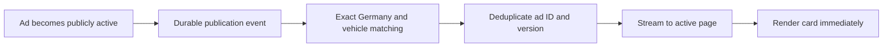

# Real-time listing research — 25 September 2026

## Decision

The user confirmed that available access is the public website only. No internal
Kleinanzeigen API, publication event stream, or approved mobile API credential
has been provided. The app must replace CarDeluxe, remain Germany-only, and
stop searching when its active page closes or pauses. No subscription was bought.

Keep the existing streaming delivery, repair demonstrated correctness problems,
and qualify a faster discovery source before changing acquisition. A new browser
transport cannot make an ad available before the upstream source exposes it.
Research has not established a free, supported public endpoint with guaranteed
instant publication notifications. This is a limit of what was found, not proof
that no faster implementation exists.

## Evidence and limits

The 24 September comparison of the deployed app and CarDeluxe recorded:

| Same advertisement | CarDeluxe time | App discovery time | Observed gap |
| --- | --- | --- | --- |
| Kleinanzeigen Opel Vectra, 3522339353 | 22:31:58 | 22:33:38 | 100 seconds |
| AutoScout24 BMW 116, efaea3d0-c742-410d-aa61-0128024b1398 | 22:34:00 | 22:34:03 | 3 seconds |

Healthy app searches took approximately 0.3–0.5 seconds, with three-second
checks. AutoScout24 also repeatedly returned HTTP 429. These are individual
observations, not p95 measurements, upload timestamps, or proof of a fixed cache
period. CarDeluxe's displayed timestamp semantics have not been independently
documented. Broader queries, a slightly changed maximum price, and a fresh query
parameter did not demonstrate additional matching new ads in the samples tested.
Sequential focused/broad search results alone cannot establish which is faster.

## Candidate discovery routes

| Route | What evidence supports | What remains unknown | Decision |
| --- | --- | --- | --- |
| Public HTML search | Existing integration works; measurable source delay | Publication-to-search delay, cache/index cause, completeness | Keep as measured baseline and fallback |
| Public search variants / narrower searches | Valid queries can produce different inventories | Repeatable speed advantage for identical matching ads | Controlled experiments only; no production fan-out yet |
| Native Kleinanzeigen saved-search notifications | Officially supported notifications for new matching ads | Delivery latency and whether an integration suitable for this app exists | Potential comparison channel, not a verified replacement feed |
| Unofficial mobile-API client | Author documents alternate page sizes and a high-volume ID discovery mode | Approved access, performance here, coverage, long-term compatibility | Research lead; not installed or connected |
| Independent API supplier | Structured queries and an available bounded comparison script | Actual arrival advantage, exact vehicle-filter mapping, sustained cost | Test only if the user chooses and supplies their own access |
| Official AutoScout24 Search API | Official GraphQL search product exists | Account access, limits, publication latency and event capabilities | Preferred supported candidate for AS24, not already connected |
| Internal publication events | Can avoid waiting for an external search result if available | No documented or approved access provided | Conditional architecture, not a current implementation |

Kleinanzeigen officially documents saved searches, but does not promise a measured
seconds-level notification SLA on the reviewed help page:
[official saved-search help](https://hilfe.kleinanzeigen.de/hc/de/articles/17102975598492-Ich-m%C3%B6chte-automatisch-neue-Suchergebnisse-zu-meiner-Suche-erhalten-Wie-richte-ich-das-ein).

The unofficial client author reports a roughly two-minute search cache and claims
15–45-second discovery when changing mobile-API page size. Its faster mode probes
successive ad IDs at much higher request volume. Those are the author's claims;
they do not validate our HTML queries. It explicitly describes a private app API.
No embedded app credential, ID enumeration, or access-control workaround was used:
[author's implementation notes](https://github.com/monkrel/kleinanzeigen-api/blob/main/README.md).

The third-party provider documents pagination and structured ads, but also
upstream throttling/errors. A webhook polling interval is not an upload-to-page
latency guarantee. Its existence therefore does not establish a solution to the
observed gap: [provider documentation](https://kleinanzeigen-agent.de/dokumentation).

AutoScout24's supported Search API is a GraphQL data product. The Listing Creation
API publishes a dealer's own inventory and should not be confused with a feed of
other sellers' new cars. No subscription/event schema is established merely by
the word GraphQL:
[Search API](https://www.autoscout24.de/haendlerportal/schnittstelle-search-api/),
[Listing Creation API](https://www.autoscout24.de/haendlerportal/api/).

## Code audit: changes and remaining priorities

**Fixed in this research turn:** Initial catch-up scans could mark a genuinely
new Kleinanzeigen listing as seen without displaying it. A subsequent live-page
check then suppressed the same listing. Once the corresponding baseline exists,
catch-up now emits a non-promoted, recent, dated ad above the fixed initial ID
floor. Old ads, undated startup inventory, and uninitialized search scopes remain
silent. Regression coverage checks later live-page deduplication as well.

The historical two-minute predictor's comments also claimed an unproven portal
contract and two-second delivery. These claims were corrected; scheduling was
not made faster by changing a comment.

**Priorities still requiring design/implementation:**

1. Coordinate portal budgets across server instances and users. Current request
   sharing and refusal state live in module Maps and are not a distributed rate
   limit. More open pages can increase upstream load. A shared lease/result store
   should allow one active upstream request per canonical query, prioritize page
   one, and fan out results to authorized viewers. Stop work when no viewers
   remain; do not install an offline collector.
2. Make filter approximation explicit or eliminate it. `kleinanzeigenUrls`
   currently drops one selected fuel/body dimension when combinations exceed
   four. This can broaden results. Exact independent matching needs trustworthy
   normalized fields; unknown fuel/body values must not be guessed. This is an
   accuracy limitation, not the explanation for the single-fuel timing sample.
3. Treat original publication time, portal display time, discovery time, and
   updates as separate fields. The fixed ID floor is a conservative heuristic:
   it rejects old bumps, but can reject an older ID activated later. AutoScout24
   HTML currently supplies no original publication timestamp. Do not label it
   verified newly uploaded, or treat a price reduction as a new upload.
4. Catch-up needs overlap and reconciliation. Moving page-number pagination is
   not a snapshot, and encountering one known ad does not prove every newer ad
   has been seen. Measure missed IDs against a complete reference when available.
5. Keep a small latency trace: request start, first source item, first client
   receipt, visible card, retry reason, and source timestamp with precision and
   provenance. Never log credentials. This separates source age from network
   and render delays without using a minute-rounded ad date as an exact clock.

## If publication events become available

Proposed path, not a claim about Kleinanzeigen's actual infrastructure:

Use the public activation event after moderation, not a draft/database insert.
Separate published, updated, price-changed, and removed events. Persist event IDs
and resume positions; reject older versions and process retries idempotently.
Reconcile after reconnect and test the snapshot/subscription boundary so an ad
cannot fall between initial inventory and live delivery.

SSE suits a server-to-browser feed and supports reconnect/event IDs; WebSockets
are useful if bidirectional interaction is needed. Neither solves upstream
freshness. The current API uses short POST/NDJSON streams and a 20-second route
duration; a long-lived SSE design must account for hosting limits and reconnects:
[MDN SSE](https://developer.mozilla.org/en-US/docs/Web/API/Server-sent_events/Using_server-sent_events),
[Vercel streaming](https://vercel.com/docs/functions/streaming-functions).

If we controlled the publisher, a transactional outbox could couple committed
public activation to durable event delivery. Search visibility can separately
depend on index refresh. These are general architectural patterns; there is no
evidence here that Kleinanzeigen uses these particular products or settings:
[Debezium outbox](https://debezium.io/documentation/reference/stable/transformations/outbox-event-router.html),
[Elastic refresh behavior](https://www.elastic.co/docs/manage-data/data-store/near-real-time-search).

## Qualification before claiming improvement

Compare identical filters and advertisement IDs simultaneously over multiple
active periods. Record first sightings independently for each candidate source
and the app; preserve unavailable observations rather than converting them to
zero latency. Report sample count, median, p95, p99, 429 rate, missed-ID rate
against the reference, duplicates, incorrect matches, and requests per minute.

A two-minute trial with no matching new ads is inconclusive. A larger response
window can improve coverage without improving per-ad freshness. An old bumped
listing must not count as a successful early new upload.

Suggested engineering targets, not measured guarantees: p95 source-item-to-card
under one second; no duplicate notifications under replay; no incorrect matches
in the controlled corpus; no losses in a controlled reconnect/burst test. A
publication-to-card target can only be evaluated against an authoritative
publication clock or a clearly identified external reference.

No API subscription was bought, no external messages sent, and no background
collector was started. The public-source discovery gap remains unproven as fixed.
